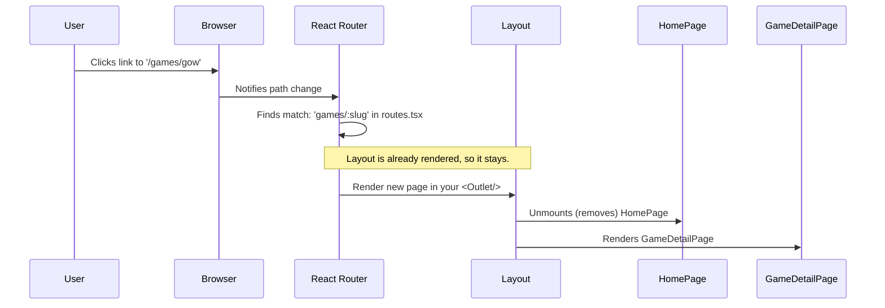

# Chapter 1: Application Routing & Page Layout

Welcome to the Game Hub project! We're excited to have you on board. This is the very first chapter, where we'll explore the foundational structure of our application.

Imagine you're designing a new building. Before you can decide what color to paint the rooms or what furniture to put inside, you need a floor plan. You need to know where the entrance is, where the hallways are, and how people will move from one room to another.

In a web application, this "floor plan" is called **Routing** and **Page Layout**. It defines how a user navigates our app and ensures a consistent look and feel across all pages.

Our main goal in this chapter is to understand how our app shows the correct page when a user visits a URL, like `game-hub.com`, and how it displays a specific game's details when they navigate to `game-hub.com/games/the-witcher-3`.

### What is Application Routing?

Think of a router as the friendly front desk receptionist of our application. When a visitor arrives (by typing a URL in their browser), the receptionist looks at the address they want to go to and directs them to the correct room (the page).

In our app, this "receptionist" is a library called `React Router`, and the list of directions is defined in a single file: `src/routes.tsx`.

Let's look at the core of this file.

```tsx
// File: src/routes.tsx

const router = createHashRouter([
    {
        path: '/',
        element: <Layout/>,
        children: [
            // ... more routes here
        ]
    },
])
```

*   `path: '/'`: This is the URL path. A single slash `/` represents the homepage or the "root" of our website.
*   `element: <Layout/>`: This tells the router which component to display when the user visits the `/` path. Here, it's our main `Layout`.

This first rule says: "When someone visits the main entrance (`/`), show them the general `Layout` of our application." But what about the specific content for the homepage? That's where `children` comes in.

```tsx
// File: src/routes.tsx (continued)
// ...
children: [
    {index: true, element: <HomePage/>},
    {path: 'games/:slug', element: <GameDetailPage/>},
]
// ...
```

*   `{index: true, element: <HomePage/>}`: The `index: true` flag marks this as the default child route. So, if the user is *exactly* at the parent's path (`/`), we'll show the `<HomePage/>` component.
*   `{path: 'games/:slug', element: <GameDetailPage/>}`: This is a more dynamic route. It says, "If the path looks like `/games/something`, then show the `<GameDetailPage/>` component." The `:slug` part is a placeholder, like a variable. It captures whatever comes after `/games/` (e.g., "the-witcher-3") so we can use it later to fetch that specific game's data.

### The Page Layout and the `<Outlet />`

We've established that `<Layout/>` is the main blueprint for our app. But what does it contain? Why do we need it?

We want common elements, like our navigation bar (`NavBar`), to appear on *every single page*. It would be tedious to add the `<NavBar/>` to both `HomePage` and `GameDetailPage` and every other page we create.

Instead, we use a central `Layout` component that acts as a template.

```tsx
// File: src/pages/Layout.tsx

import {Outlet} from "react-router-dom";
import NavBar from "../components/NavBar.tsx";
import {Box} from "@chakra-ui/react";

const Layout = () => {
    return (
        <>
            <NavBar/>
            <Box padding={5}>
                <Outlet/>
            </Box>
        </>
    );
};
```

This is our "floor plan" in action.
1.  `<NavBar/>`: This is the navigation bar at the top. It's defined once here and will always be present.
2.  `<Outlet/>`: This is the most magical part. Think of `<Outlet/>` as an empty picture frame. Our router uses this frame to display the actual page content. When you're on the homepage, `<HomePage/>` is placed inside the `<Outlet/>`. When you navigate to a game's detail page, the router swaps the content, placing `<GameDetailPage/>` inside the very same `<Outlet/>`.

This structure keeps our app DRY (Don't Repeat Yourself) and makes it easy to manage.

### Under the Hood: A User's Journey

Let's trace what happens step-by-step when a user clicks on a game to see its details.

1.  **The Click**: The user is on the `HomePage` and clicks a game card. This card contains a special `<Link>` component from React Router.

    ```tsx
    // File: src/components/GameCard.tsx

    <Link to={'/games/' + game.slug}>{game.name}</Link>
    ```

    This `Link` tells the router: "Hey, the user wants to go to the `/games/the-witcher-3` page."

2.  **The Routing**: React Router intercepts this request. It doesn't reload the whole website. Instead, it looks at its map in `routes.tsx`.

3.  **The Match**: It scans the routes and finds a match: `path: 'games/:slug'`. It knows it needs to render the `<GameDetailPage/>` component and that the value for `:slug` is "the-witcher-3".

4.  **The Render**: Because `GameDetailPage` is a child of the `Layout` route, the `Layout` component itself stays on the screen. The router simply replaces the content inside the `<Outlet/>` with the new `<GameDetailPage/>`.

Here is a diagram illustrating this flow:



Finally, our application entry point in `main.tsx` ties everything together by telling our app to use the router we just defined.

```tsx
// File: src/main.tsx

// ... imports
import {RouterProvider} from "react-router-dom";
import router from "./routes.tsx";

// ... other setup

ReactDOM.createRoot(document.getElementById('root')!).render(
    // ... wrapping providers
    <RouterProvider router={router}></RouterProvider>
    // ...
)
```

The `<RouterProvider>` component is the top-level component from React Router that makes all this routing magic possible.

### Conclusion

Congratulations! You've just learned about the backbone of our application.

-   **Routing** (`routes.tsx`) acts as a map, connecting URLs to specific React components.
-   **Page Layout** (`Layout.tsx`) provides a consistent shell for all our pages, holding common elements like the navigation bar.
-   The **`<Outlet/>`** is a placeholder inside our Layout where the content for the current page is dynamically rendered.

This setup gives us a powerful and organized way to manage navigation and the overall structure of our app.

Now that we understand the floor plan, it's time to start putting some furniture in the rooms. In the next chapter, we'll focus on the homepage and see how we display a beautiful grid of games.

Next: [Chapter 2: Game Grid & Cards](02_game_grid___cards_.md)

---

