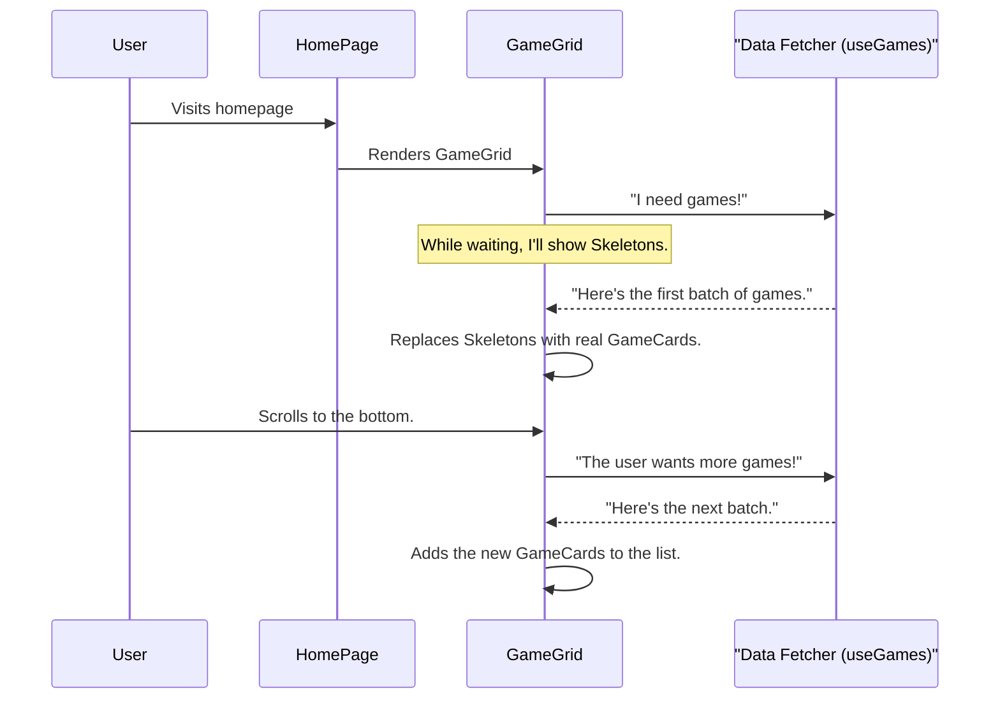

# Chapter 2: Game Grid & Cards

In our last chapter, [Application Routing & Page Layout](01_application_routing___page_layout_.md), we built the "floor plan" for our application. We now have a solid structure with a navigation bar and a designated area (`<Outlet/>`) for our page content. Now, it's time to furnish our main room: the `HomePage`.

The main purpose of our Game Hub is to showcase video games. We want to display them in an attractive, organized way. Imagine you're looking through a magical, infinitely long photo album. As you flip the pages (or in our case, scroll down), new photos just appear. That's exactly what we're going to build.

### The Core Components of Our Display

To create this "photo album" experience, we'll use a few specialized components that work together. Breaking down a big problem into smaller, manageable pieces is a cornerstone of modern web development.

1.  **`GameCard`**: This is the individual "photo" in our album. It's a neat little card that shows a game's image, its name, its review score, and which platforms it's available on (like PlayStation, Xbox, or PC). Each card is self-contained.

2.  **`GameGrid`**: This is the "photo album" itself. Its job is to arrange all the `GameCard`s in a nice, responsive grid. Crucially, it's also responsible for fetching the game data and loading more games as the user scrolls down the page.

3.  **`GameCardContainer`**: Think of this as a fancy "picture frame" for each `GameCard`. It's a simple component whose only job is to add a cool visual effect: when you hover your mouse over a game card, it slightly grows in size, making the interface feel more interactive.

4.  **`GameCardSkeleton`**: What happens while we're waiting for the game images and data to load from the internet? We don't want to show a blank screen. The `GameCardSkeleton` acts as a placeholder. It shows a gray, shimmering outline of a card, letting the user know that content is on its way.

### How They Work Together

On our `HomePage`, we don't need to do much. We simply place the main "photo album" component, `<GameGrid/>`, and it takes care of the rest.

```tsx
// File: src/pages/HomePage.tsx

// ... imports
import GameGrid from "../components/GameGrid.tsx";

const HomePage = () => {
    return (
        <Grid ...>
            {/* ... other components like genre list ... */}
            <GridItem area='main'>
                {/* ... heading and filter dropdowns ... */}
                <GameGrid />
            </GridItem>
        </Grid>
    );
};
```

All the magic is encapsulated within `<GameGrid/>`. Let's peek inside to see how it works.

### The `GameCard`: A Single Game's Portrait

The `GameCard` is a straightforward component. It receives a `game` object, which contains all the information about one game, and it displays that information.

```tsx
// File: src/components/GameCard.tsx

const GameCard = ({game}: Props) => {
    return (
        <Card>
            <Image src={getCroppedImageUrl(game.background_image)}/>
            <CardBody>
                {/* We show platform icons and the game's score here */}
                <HStack justifyContent='space-between' marginBottom={3}>
                    <PlatformIconList platforms={...}/>
                    <CriticScore score={game.metacritic}/>
                </HStack>
                {/* The game's name is a link to its detail page */}
                <Heading fontSize='2xl'>
                    <Link to={'/games/' + game.slug}>{game.name}</Link>
                </Heading>
            </CardBody>
        </Card>
    );
};
```

This component is like a template. For every game we get from our data source, we create one `GameCard` and fill it with that game's specific details.

### The `GameGrid`: The Infinite Photo Album

The `GameGrid` is the orchestrator. It fetches the data and decides what to show and when.

Here's a simplified look at its logic:

1.  **Fetch Data**: It uses a special function (a "hook") called `useGames` to start fetching the list of games. We'll dive deep into this hook in our next chapter, [API Data Fetching Layer](03_api_data_fetching_layer_.md). For now, just know that it gives us the `data`, a loading status `isLoading`, and a way to `fetchNextPage`.

2.  **Show Skeletons**: If `isLoading` is true (meaning we're waiting for the very first batch of games), we display a grid of `GameCardSkeleton` placeholders.

    ```tsx
    // File: src/components/GameGrid.tsx
    
    const {data, error, isLoading, ...} = useGames();
    const skeletons = [1, 2, 3, 4, 5, 6]; // An array to help us loop
    
    // ... inside the return statement
    {isLoading &&
        skeletons.map((skeleton) => (
            <GameCardContainer key={skeleton}>
                <GameCardSkeleton />
            </GameCardContainer>
        ))}
    ```

3.  **Show Games**: Once `isLoading` is false and we have `data`, we map over the list of games and render a `GameCard` for each one, wrapped in our stylish `GameCardContainer`.

    ```tsx
    // File: src/components/GameGrid.tsx
    
    {data.pages.map((page, index) =>
        <React.Fragment key={index}>
            {page.results.map(game => 
                <GameCardContainer key={game.id}>
                    <GameCard game={game}/>
                </GameCardContainer>
            )}
        </React.Fragment>
    )}
    ```
    *Why the double loop?* The data comes in "pages." `data.pages` is an array of pages, and each `page` has a `results` array containing the games. `React.Fragment` is an invisible wrapper that lets us group list items without adding extra clutter to our webpage.

### Under the Hood: The Journey of a Game Grid

Let's follow the step-by-step process from the moment a user lands on our `HomePage`.



The "load more on scroll" magic is handled by a library called `react-infinite-scroll-component`. We wrap our entire grid in it.

```tsx
// File: src/components/GameGrid.tsx

import InfiniteScroll from "react-infinite-scroll-component";

// ...

return (
    <InfiniteScroll
        dataLength={data.pages.reduce(...)} // Total items currently shown
        next={fetchNextPage} // The function to call for more data
        hasMore={hasNextPage} // Is there more data available?
        loader={<Spinner />} // A small loading spinner at the bottom
    >
        {/* Our grid of game cards goes here */}
    </InfiniteScroll>
);
```

This component does the hard work of detecting when the user is near the bottom of the page and automatically calls `fetchNextPage` for us. This is how our "photo album" seems to go on forever!

### Conclusion

We've just built the visual heart of our application! By breaking the problem down, we've created a clean and powerful system.

-   **`GameCard`** is our reusable template for displaying a single game.
-   **`GameCardSkeleton`** gives the user a polished loading experience.
-   **`GameCardContainer`** adds a little bit of interactive flair.
-   **`GameGrid`** is the smart container that orchestrates everything: fetching data, showing loading states, and displaying an infinitely scrolling list of games.

We've seen *what* components are displayed and *how* they're arranged. But where does the game data actually come from? How does the `useGames` hook work its magic? We'll uncover all of that in the next chapter.

Next: [Chapter 3: API Data Fetching Layer](03_api_data_fetching_layer_.md)

---

