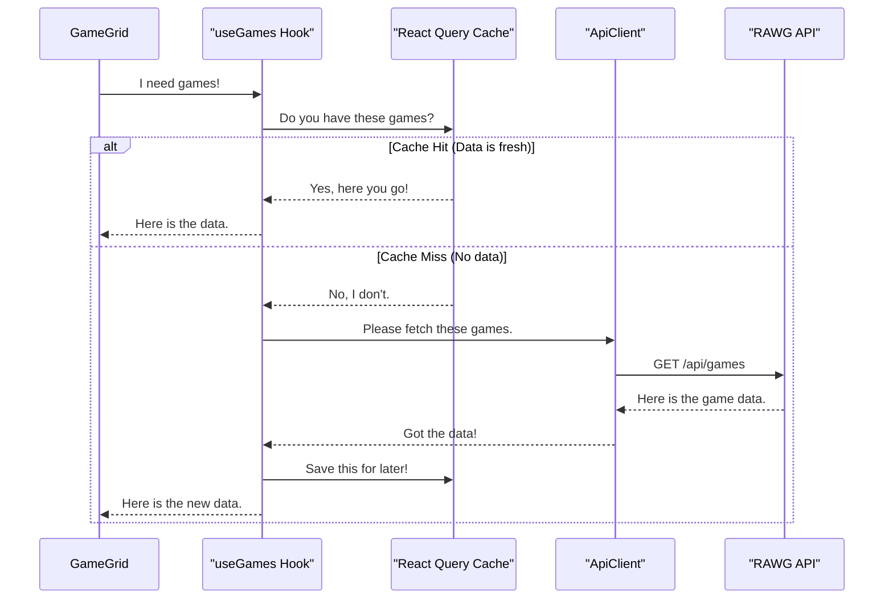

# Chapter 3: API Data Fetching Layer

In the last chapter, [Game Grid & Cards](02_game_grid___cards_.md), we built the beautiful, infinitely-scrolling grid that displays our games. We saw that the `<GameGrid/>` component called a magical hook, `useGames()`, to get all the data it needed. But how does that hook actually work? Where does the data come from?

Welcome to the engine room of our application! This chapter explores our **API Data Fetching Layer**, the system responsible for communicating with the outside world to get all the game information we need.

### Why Do We Need a "Fetching Layer"?

Our app doesn't have its own database of every video game ever made. That would be massive! Instead, we rely on a huge, public online database called the **RAWG API**.

Think of the RAWG API as a giant, public library full of video game books. Our app needs to be able to go to this library, ask for specific books (like "all action games" or "details for The Witcher 3"), and bring them back to display.

Doing this directly from our components would be messy. Every component that needs data would have to know the library's address, the secret handshake (API key), and the exact way to ask for each book. If the library ever moved or changed its rules, we'd have to update every single component!

Our fetching layer solves this by creating a clean, centralized system for all data requests.

### Our Key Tools

Our data fetching layer is built from a few key parts that work together brilliantly:

1.  **`ApiClient` (The Librarian)**: This is our specialized "librarian" who knows exactly how to talk to the RAWG API. It knows the library's address (`baseURL`), has the key to get in (`API Key`), and understands the language of requests. We can give it a simple instruction like "get me all the genres," and it handles all the complicated details.

2.  **`use...` Hooks (The Speed-Dial Buttons)**: Hooks like `useGames` and `useGenres` are like speed-dial buttons on a phone. They are pre-programmed for specific, common requests. For example, `useGames` is our "get the list of games" button. It uses our `ApiClient` to make the call.

3.  **React Query (The Clever Memory)**: This is the most magical part. Imagine you ask the librarian for a book, and they hand it to you. A minute later, you ask for the same book again. A normal librarian would go all the way back to the shelf to get it. Our librarian, powered by React Query, has a clever memory (a **cache**). It keeps the book at the front desk for a while, so if you ask again, it can hand it to you instantly. This makes our app feel incredibly fast and reduces unnecessary calls to the API.

### Under the Hood: A Request's Journey

Let's trace what happens when our `GameGrid` component needs to display games.

1.  **The Ask**: The `GameGrid` component renders and calls `useGames()`.
2.  **The Check**: `useGames` (powered by React Query) first checks its memory: "Have I fetched this exact list of games recently?"
3.  **The Decision**:
    *   **If YES (Cache Hit)**: The data is in memory! React Query instantly returns the cached data. The `GameGrid` displays the games almost immediately.
    *   **If NO (Cache Miss)**: The data is not in memory. React Query then says, "Okay, time to make a real request."
4.  **The Call**: React Query uses our `ApiClient` to make a network call to the RAWG API.
5.  **The Response**: The RAWG API sends back a list of games.
6.  **The Result**: The `ApiClient` gives this data back to React Query, which does two things:
    *   It saves the data in its memory (cache) for next time.
    *   It gives the data to our `GameGrid` component to finally display on the screen.

Here is a diagram of this flow:



### Diving into the Code

Let's look at the simple, powerful code that makes this happen.

#### `api-client.ts`: Our Universal Communicator

This file defines our `ApiClient`. First, we set up the connection details.

```typescript
// File: src/services/api-client.ts

import axios from "axios";

const axiosInstance = axios.create({
    baseURL: 'https://api.rawg.io/api',
    params: {
        key: 'f4ef000bfe6749038685cc5a314359e1'
    }
})
```

*   `baseURL`: This is the address of the RAWG API "library." Every request we make will start with this URL.
*   `params: { key: ... }`: This is our secret API key. It's like a library card that proves we have permission to access the data. `axios` will automatically attach this to every request.

Next is the `ApiClient` class itself, a reusable blueprint.

```typescript
// File: src/services/api-client.ts

class ApiClient<T> {
    endpoint: string;

    constructor(endpoint: string) {
        this.endpoint = endpoint
    }

    getAll = (config: AxiosRequestConfig) => {
        return axiosInstance
            .get<FetchResponse<T>>(this.endpoint, config)
            .then(res => res.data);
    }
    // ... other methods like get() for a single item
}
```

*   This is a generic class, meaning it can be used to fetch any type (`T`) of data, whether it's games, genres, or platforms.
*   The `constructor` lets us create a specific client for a specific "aisle" in the library (e.g., `/games` or `/genres`).
*   `getAll` is the method that performs the actual `GET` request to fetch a list of items.

#### `useGenres.ts`: A Simple Speed-Dial Button

Now let's see how we use `ApiClient` to create a simple hook for fetching genres.

```typescript
// File: src/hooks/useGenres.ts

const apiClient = new ApiClient<Genre>('/genres');

const useGenres = () => {
    return useQuery({
        queryKey: ['genres'],
        queryFn: apiClient.getAll,
        staleTime: 60_000 * 60 * 24, // 24 hours
        initialData: genres,
    })
}
```

This is so clean!
1.  We create a new `ApiClient` specifically for fetching `Genre` data from the `/genres` endpoint.
2.  `useQuery` is the primary hook from React Query.
    *   `queryKey: ['genres']`: This is the unique label for this data in the cache. It's how React Query finds it later.
    *   `queryFn: apiClient.getAll`: This tells React Query *what function to call* if the data isn't in the cache.
    *   `staleTime`: We tell React Query: "The list of genres rarely changes. Once you fetch it, don't even bother asking for it again for 24 hours. The data is considered 'fresh'."
    *   `initialData`: We provide some hard-coded `genres` data. The app can show this immediately while React Query fetches the latest list in the background. This makes the UI feel instantaneous.

#### `useGames.ts`: An Advanced Speed-Dial Button

The `useGames` hook is a bit more complex because it handles filtering, sorting, and infinite scrolling.

```typescript
// File: src/hooks/useGames.ts

const useGames = () => {
    const gameQuery = useGameQueryStore(s => s.gameQuery);
    return useInfiniteQuery<FetchResponse<Game>, Error>({
        queryKey: ['games', gameQuery],
        queryFn: ({ pageParam = 1 }) => apiClient.getAll({
            params: {
                // ...params based on gameQuery
                page: pageParam
            }
        }),
        // ... more config
    });
}
```

*   `useInfiniteQuery`: A special version of `useQuery` designed for "infinite scroll" lists.
*   `queryKey: ['games', gameQuery]`: Notice the key is more complex now. It includes the `gameQuery` object, which holds the current filters (like selected genre or platform). If the user changes the filter, `gameQuery` changes, creating a *new* query key. This tells React Query to fetch and cache this new, specific request separately. We'll learn all about `gameQuery` in the [Game Query Store (Global State)](05_game_query_store__global_state_.md) chapter.
*   `queryFn`: The function we run to get the data. It receives a `pageParam` and passes it along to our `apiClient` to fetch the correct page of results.

### Conclusion

You've just toured the engine of our application! We've created a powerful, clean, and efficient system for fetching data.

-   The **`ApiClient`** acts as our single, reliable connection to the external RAWG API.
-   Our custom **`use...` hooks** provide simple, reusable "speed-dial buttons" for our components to request data.
-   **React Query** gives our app a super-powered memory (cache), making it feel fast, reducing redundant requests, and handling complex states like loading and errors for us.

This layered approach is fantastic because it separates concerns. Our UI components, like `<GameGrid>`, don't need to worry about *how* to fetch data; they just need to *ask* for it.

We've mentioned that our `ApiClient` fetches data structured as a `Game` or a `Genre`. But what do those data structures look like? What information does a `Game` object actually contain? That's exactly what we'll define in our next chapter.

Next: [Chapter 4: Data Models (Entities)](04_data_models__entities__.md)

---

