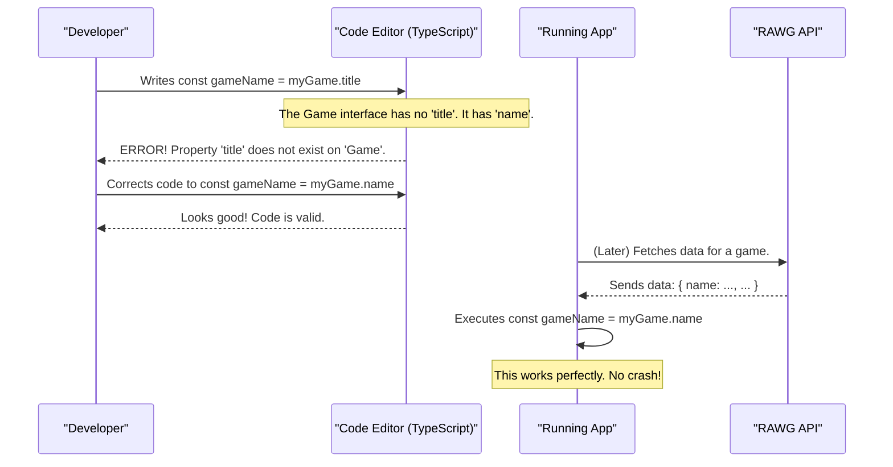

# Chapter 4: Data Models (Entities)

In our previous chapter, [API Data Fetching Layer](03_api_data_fetching_layer_.md), we built the engine that connects to the outside world and fetches all our game data. We saw how `useGames()` asks for a list of games and receives a response. But what does that response actually look like? If we get data for a game, how do we know for sure that it contains a `name` and not a `title`?

This is where our **Data Models**, or **Entities**, come into play. They are the essential blueprints that define the exact structure of our data.

### The Need for a Blueprint

Imagine you order a piece of furniture online that requires assembly. You open the box, and inside are dozens of screws, panels, and brackets, but... there are no instructions. You might be able to guess how it fits together, but you'll probably make mistakes. Maybe you use the wrong screw, or put a panel on backward.

In programming, working with data from an external API without a "blueprint" is just like that. The API sends us a big chunk of data (the parts), and we have to guess its structure. If the API sends `background_image` but we try to use `game.backgroundImage` in our code, our app will crash.

Data Models are our assembly instructions. They tell our code (and us, the developers) exactly what properties to expect for each piece of data, and what type each property will be (a number, some text, a list of items, etc.).

### What is a Data Model?

In our project, a data model is a **TypeScript Interface**. An interface is a special TypeScript feature that acts as a contract or a blueprint for an object. It defines the "shape" that an object must have.

The most important thing to know is that **interfaces are a development-time tool**. They don't exist when your app is running in the browser. Their only job is to help us write correct code and prevent bugs before they happen.

Let's look at a very simple example. The API sends us a list of genres, and each one looks something like this: `{ "id": 4, "name": "Action", "image_background": "..." }`.

We can create a blueprint for this in our code.

```typescript
// File: src/entities/Genre.ts

export interface Genre {
    id: number,
    name: string,
    image_background: string
}
```

This is incredibly clear!
*   `export interface Genre`: We're defining a new blueprint named `Genre` that we can use anywhere in our app.
*   `id: number`: A `Genre` object *must* have an `id` property, and its value must be a number.
*   `name: string`: It *must* have a `name` property, and its value must be text (a string).
*   `image_background: string`: It *must* have an `image_background` property, which is also a string.

### Building More Complex Blueprints

Blueprints can also be built from other blueprints. Our `Game` entity is more complex and contains information about its platforms, genres, and more.

```typescript
// File: src/entities/Game.ts
import { Platform } from "./Platform.ts";
import { Genre } from "./Genre.ts";

export interface Game {
    id: number,
    name: string,
    slug: string,
    genres: Genre[],
    background_image: string;
    parent_platforms: { platform: Platform } [],
    metacritic: number,
}
```

Let's break this down:
*   It has simple properties like `id` (a number) and `name` (a string).
*   `genres: Genre[]`: This is powerful! It says a `Game` must have a `genres` property, and its value must be an **array (`[]`) of `Genre` objects**. This means every item inside the `genres` array must follow the `Genre` blueprint we defined earlier.
*   `parent_platforms: { platform: Platform } []`: This is similar. It's an array of objects, where each object has a single property named `platform` which must follow the `Platform` blueprint.

### How Our App Uses These Blueprints

Now that we have these contracts, we can enforce them throughout our code to gain "type safety."

Remember our `ApiClient` from the [API Data Fetching Layer](03_api_data_fetching_layer_.md)? We can tell it exactly what kind of data to expect.

```typescript
// File: src/hooks/useGenres.ts
import { Genre } from '../entities/Genre';

// ...
const apiClient = new ApiClient<Genre>('/genres');
```

The `<Genre>` part is like telling our librarian, "When you go to the `/genres` aisle, the books you bring back *must* follow the `Genre` blueprint." TypeScript will now ensure that we treat the fetched data as `Genre` objects.

This safety net extends all the way to our components. Look at our `GameCard`.

```typescript
// File: src/components/GameCard.tsx
import { Game } from '../entities/Game';

interface Props {
    game: Game;
}

const GameCard = ({ game }: Props) => {
    return (
        // ...
        <Heading>{game.name}</Heading>
    )
}
```

By declaring `game: Game`, we're making a promise: "The `game` prop passed to this component will always adhere to the `Game` blueprint."

Now, if we accidentally try to access a property that doesn't exist...

```typescript
const GameCard = ({ game }: Props) => {
    // TRYING TO ACCESS A PROPERTY THAT DOESN'T EXIST
    return <Heading>{game.title}</Heading> // This will show an error!
}
```

Our code editor (and the TypeScript compiler) will immediately underline `game.title` in red and give us an error: `Property 'title' does not exist on type 'Game'. Did you mean 'name'?` It caught the bug for us before we even saved the file!

### Under the Hood: The Pre-Flight Check

The "magic" of interfaces happens entirely during development, not when the app is running. Think of it as a pre-flight check for a pilot. The pilot checks everything on the ground to ensure a safe flight, long before the plane is in the air. TypeScript checks our code against our blueprints to ensure a bug-free experience for the user.

Here’s how that pre-flight check saves us:



By defining the shape of our data upfront, we create a contract between the API and our code. TypeScript enforces this contract, making our application more robust, predictable, and easier for teams to work on.

### Conclusion

You've just learned about one of the most important concepts for building large, stable applications: **Data Models**.

-   **Entities/Data Models** are TypeScript interfaces that act as **blueprints** for our data.
-   They define the **shape** of objects, specifying what properties they must have and what their types are.
-   This provides **type safety**, allowing our tools to catch bugs and typos *before* the code ever runs.
-   This makes our code more predictable, easier to read, and simpler to maintain.

We now know *how* to get data and what its *shape* is. But our application has filters for genre, platform, and sorting order. How do we keep track of the user's selections and make sure all our components are in sync? We need a central place to store this information. That's the job of our global state manager, which we'll explore next.

Next: [Chapter 5: Game Query Store (Global State)](05_game_query_store__global_state_.md)

---

