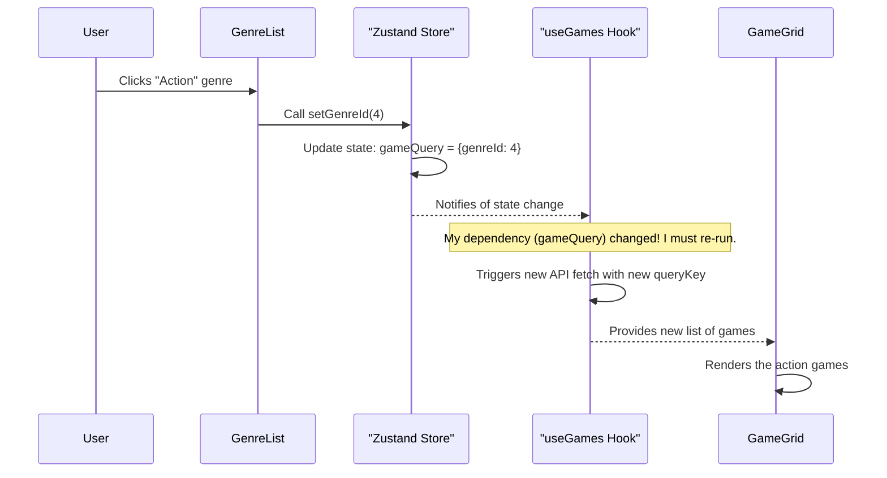

# Chapter 5: Game Query Store (Global State)

In our previous chapter, [Data Models (Entities)](04_data_models__entities__.md), we created the blueprints for our data, ensuring our app knows the exact shape of a `Game` or `Genre` object. We now have the components to display data, a way to fetch it, and blueprints to understand it.

But how do all these pieces talk to each other? Imagine a user clicks on the "Action" genre in the sidebar. How does the `GameGrid` in the center of the page know that it should now only show action games? The genre list and the game grid are separate components!

This is the problem our **Game Query Store** solves. It's the central hub for communication in our app.

### The Shared Notepad Analogy

Think of our application as a team of people working in an office.
*   The `GenreList` component is one person.
*   The `PlatformSelector` dropdown is another person.
*   The `SearchInput` bar is a third person.
*   The `GameGrid` (and its data-fetching hook) is the person who goes and gets the games.

If they all keep their own private notes, they can't work together. If the `GenreList` person writes "the user wants Action games" on their personal notepad, the `GameGrid` person will never see it.

We need a **shared notepad** or a central whiteboard that everyone can see and update. This is our **Global State**.

In our app, this "shared notepad" is called the **Game Query Store**. When a user picks a genre, the `GenreList` component writes "Genre ID: 4" on the shared notepad. When the user selects "PlayStation", the `PlatformSelector` component adds "Platform ID: 2" to the notepad.

Finally, our data-fetching hook, `useGames`, constantly looks at this notepad. As soon as it sees a change, it says, "Aha! The user's query has changed. I need to go get a new list of games based on these new instructions." This ensures all parts of our app are perfectly in sync.

The tool we use to create this shared notepad is a small, simple library called **Zustand**.

### Creating Our "Notepad": The Store

Let's build our shared notepad. The entire definition for this lives in a single, simple file: `src/store.ts`.

#### 1. The Blueprint for our Notes

First, we need to define what kind of notes we can write on our notepad. We'll use a TypeScript interface for this, just like we did for our [Data Models (Entities)](04_data_models__entities__.md).

```typescript
// File: src/store.ts

export interface GameQuery {
    genreId?: number;
    platformId?: number;
    sortOrder?: string;
    searchText?: string;
}
```

This `GameQuery` interface says that our notepad can store a `genreId`, a `platformId`, a `sortOrder`, and some `searchText`. The `?` means each of these is optional.

#### 2. Defining the Notepad and its Actions

Next, we define the store itself. This includes the `GameQuery` object (our notepad) and the functions we can use to change it (the "actions").

```typescript
// File: src/store.ts

interface GameQueryStore {
    gameQuery: GameQuery;
    setSearchText: (text: string) => void;
    setGenreId: (genreId: number) => void;
    setPlatformId: (platformId: number) => void;
    setSortOrder: (order: string) => void;
}
```

This interface says our `GameQueryStore` will contain:
*   `gameQuery`: The actual notepad object that holds our filters.
*   `set...`: A list of functions that components can call to update the notepad.

#### 3. Bringing the Store to Life with Zustand

Finally, we use the `create` function from Zustand to build the store.

```typescript
// File: src/store.ts
import {create} from "zustand"
// ...interfaces from above

const useGameQueryStore = create<GameQueryStore>(set => ({
    gameQuery: {},
    setGenreId: (genreId) => set(store => ({
        gameQuery: { ...store.gameQuery, genreId }
    })),
    // ... other setter functions
}));

export default useGameQueryStore;
```

This might look a bit tricky, but it's quite simple:
*   `create<GameQueryStore>`: We tell Zustand to create a new store that must follow our `GameQueryStore` blueprint.
*   `gameQuery: {}`: We start with a blank notepad.
*   `setGenreId: (genreId) => ...`: We define what happens when a component calls `setGenreId`. It calls Zustand's `set` function.
    *   `set(store => ...)`: This function receives the current state of the store.
    *   `{ gameQuery: { ...store.gameQuery, genreId } }`: This is the key part. It creates a *new* `gameQuery` object. It first copies all the old values (`...store.gameQuery`) and then adds or overwrites the `genreId` with the new one. This is how we update one part of the notepad without erasing the rest.

### Using the Store: Reading and Writing

Now that our shared notepad exists, let's see how our components use it.

#### Writing to the Store

Our `GenreList` component is responsible for updating the selected genre. When a user clicks a genre, it needs to write that choice to our shared notepad.

```tsx
// File: src/components/GenreList.tsx

import useGameQueryStore from "../store.ts";

const GenreList = () => {
    // ... code to get the list of genres ...
    const setGenreId = useGameQueryStore(s => s.setGenreId);

    return (
        <List>
            {/* Loop through each genre */}
            <Button onClick={() => setGenreId(genre.id)}>
                {genre.name}
            </Button>
        </List>
    );
};
```

1.  `useGameQueryStore(s => s.setGenreId)`: We "select" only the `setGenreId` function from our store. We don't need the whole notepad, just the pen!
2.  `onClick={() => setGenreId(genre.id)}`: When a user clicks the button for a genre, we call the `setGenreId` function with that genre's ID. This action "writes" the new genre choice onto our shared notepad.

The `PlatformSelector`, `SortSelector`, and `SearchInput` components all work in exactly the same way, calling their respective "set" functions.

#### Reading from the Store

How does the data fetching layer know what to do? It *reads* from the notepad. Our custom hook `useGames`, which we learned about in the [API Data Fetching Layer](03_api_data_fetching_layer_.md) chapter, is the primary reader.

```typescript
// File: src/hooks/useGames.ts
import useGameQueryStore from "../store.ts";

const useGames = () => {
    const gameQuery = useGameQueryStore(s => s.gameQuery);

    return useInfiniteQuery({
        queryKey: ['games', gameQuery],
        queryFn: () => apiClient.getAll({
            params: {
                genres: gameQuery.genreId,
                parent_platforms: gameQuery.platformId,
                //... other params
            }
        }),
        //...
    });
}
```

1.  `const gameQuery = useGameQueryStore(s => s.gameQuery)`: The `useGames` hook subscribes to the entire `gameQuery` object on our notepad.
2.  `queryKey: ['games', gameQuery]`: This is the magic connection. We tell React Query that the unique key for this data request includes the `gameQuery` object. If `gameQuery` ever changes (because a user clicked a genre), this key will change. React Query sees the new key and automatically re-runs the query to fetch fresh data.
3.  `params: { genres: gameQuery.genreId, ... }`: We pass the values from our notepad directly to the API request.

### Under the Hood: The Full Journey of a Click

Let's trace the entire flow, from a user's click to the updated game list on screen.

1.  **The Click**: A user clicks the "Action" genre button in the `GenreList` component.
2.  **The Write**: The `onClick` handler in `GenreList` calls `setGenreId(4)`.
3.  **The Update**: Zustand receives this and updates the `gameQuery` object in its store. The notepad now says `{ genreId: 4 }`.
4.  **The Notification**: Zustand notifies all subscribed components that the state has changed.
5.  **The Re-render**: The `useGames` hook is subscribed to `gameQuery`, so it re-runs. It sees that `gameQuery` is now a new object.
6.  **The New Fetch**: Because the `queryKey` in `useInfiniteQuery` has changed from `['games', {}]` to `['games', { genreId: 4 }]`, React Query automatically triggers a new data fetch with the updated parameters.
7.  **The Display**: Once the new data (only action games) arrives, the `GameGrid` component receives it and displays the updated list of games.

Here is a diagram of this lightning-fast process:



### Conclusion

Congratulations! You've just mastered the nervous system of our application. The **Game Query Store** is a powerful pattern that allows different, disconnected parts of our app to communicate seamlessly.

-   We created a central, **global state** (a "shared notepad") using **Zustand**.
-   UI components like `GenreList` can **write** to this state when the user interacts with them.
-   Our data-fetching layer (`useGames` hook) can **read** from this state to know exactly what data the user wants.
-   The combination of Zustand and React Query creates a reactive system that automatically updates our UI whenever the user's selections change.

You've now seen all the core pieces of the Game Hub project, from the overall page structure and routing, to displaying components, fetching data, defining its shape, and finally, managing the application's state. You have all the knowledge you need to explore, modify, and build upon this foundation. Happy coding

---

