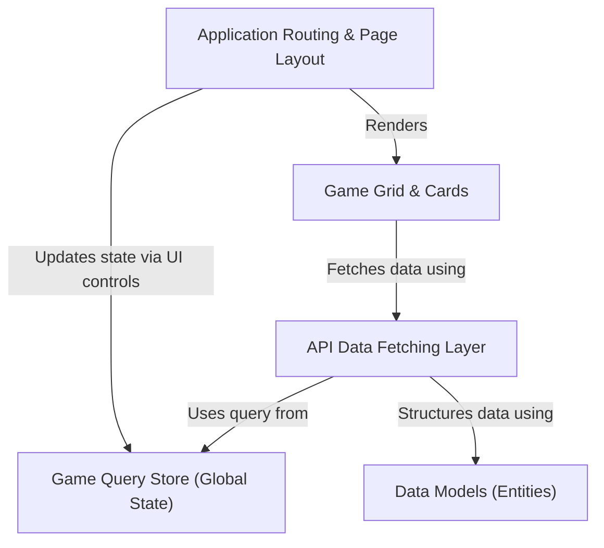

# Tutorial: game-hub

This project is a modern *web application* for browsing and discovering video games. It provides a user-friendly interface to a massive game database, allowing users to **search**, **filter** by genre or platform, and **sort** the results. The application displays games in an infinite-scrolling grid and provides detailed information on dedicated pages for each game, all while efficiently managing user selections using a *central state store*.

**Source Repository:** [https://github.com/fancellu/game-hub](https://github.com/fancellu/game-hub)

## Chapters

1. [Application Routing & Page Layout
](01_application_routing___page_layout_.md)
2. [Game Grid & Cards
](02_game_grid___cards_.md)
3. [API Data Fetching Layer
](03_api_data_fetching_layer_.md)
4. [Data Models (Entities)
](04_data_models__entities__.md)
5. [Game Query Store (Global State)
](05_game_query_store__global_state__.md)

---

